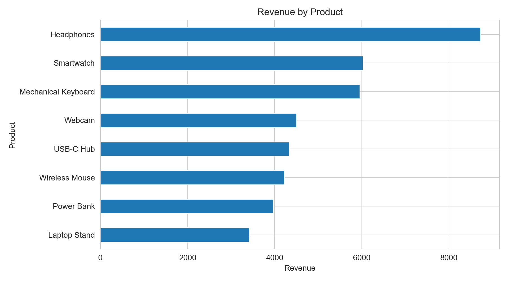
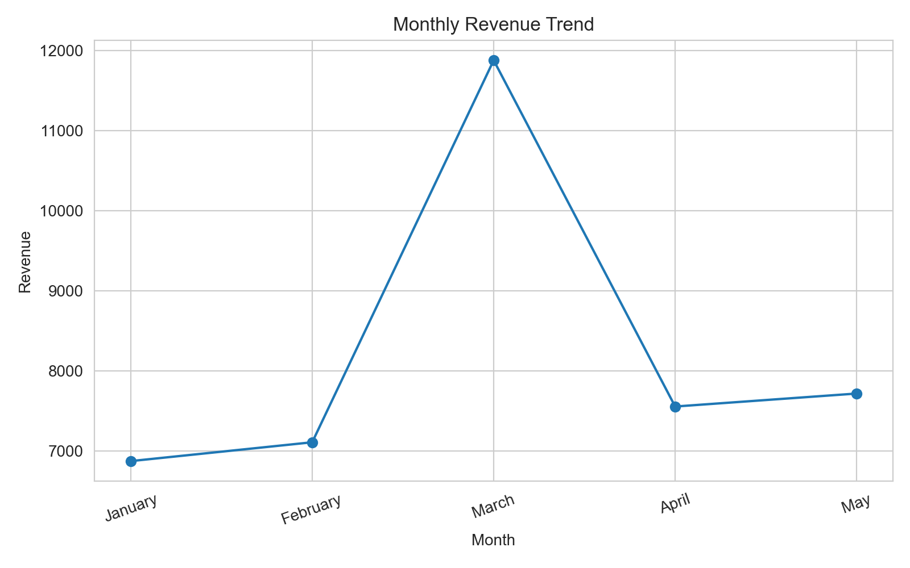

# AI-Assisted Business Analytics Capstone — Final Report

## 1. Business Scenario
A small online retail company wants to improve business performance because sales have slightly decreased, products perform differently, marketing campaigns have different results, and customer retention needs improvement. The assignment asks for a small student-created sales dataset, sales analysis, five AI prompts, prompt-engineering comparisons, responsible-AI analysis, privacy analysis, and a 6–8 slide presentation.

## 2. Dataset
The project uses a 40-row synthetic sales dataset with the required fields:
- Product Name
- Category
- Month
- Units Sold
- Revenue
- Region

Total units sold: **752**
Total revenue: **41,140.00**

## 3. Sales Analytics
| Question | Result |
|---|---|
| Highest-revenue product | **Headphones** — 8,722.00 |
| Best-performing category | **Accessories** — 15,943.00 |
| Highest-sales month | **March** — 11,877.00 |
| Best-performing region | **North** — 14,242.00 |

### Chart 1 — Revenue by Product

### Chart 2 — Monthly Revenue Trend

## 4. Key Findings
1. **Headphones generated the highest revenue**, making it the leading individual product in the sample.
2. **Accessories was the top category**, supported by the combined contribution of its products.
3. **March was the strongest month**, indicating a clear peak in the five-month sample.
4. **North was the strongest region**, contributing the largest regional revenue total.
5. The dataset contains **40 sales records and 752 units**, with total revenue of **41,140**.
6. Revenue concentration differs by product, category, month, and region, so a single KPI does not fully explain performance.
7. High revenue does not automatically imply the highest unit volume; both metrics should be considered together.
8. The sample is small and synthetic, so the findings are useful for demonstrating analytics but should not be treated as forecasts of a real company.

## 5. Business Recommendations
1. **Protect availability of high-contribution products.** Monitor stock for Headphones and other top-revenue items.
2. **Plan inventory and campaigns around March-like peaks.** Use the observed monthly pattern as a planning signal, not as proof of future seasonality.
3. **Target regions differently.** Prioritize the North while investigating the causes of lower revenue in weaker regions.
4. **Use product and category performance together.** Promotion decisions should consider both revenue and unit demand.
5. **Track recurring KPIs.** Monitor monthly revenue, units sold, top-product share, and regional revenue to evaluate campaign impact.

## 6. Five AI Prompts
### Prompt 1 — Sales Analysis
**Prompt:** Analyze the attached sales dataset. Calculate total revenue and units sold, identify the top product, category, month, and region, and summarize the results in a concise table.

**Purpose:** Establish a factual sales baseline.

**Output Generated:** Ranked metrics and a concise summary.

**Business Value:** Gives management a quick view of where sales are concentrated.

### Prompt 2 — Product Performance
**Prompt:** Compare products by revenue and units sold. Identify high-revenue products, explain any mismatch between unit volume and revenue, and suggest one metric management should monitor for each product.

**Purpose:** Understand product contribution.

**Output Generated:** Product comparison with monitoring metrics.

**Business Value:** Supports inventory and promotion decisions.

### Prompt 3 — Monthly Sales Trend
**Prompt:** Analyze revenue by month, identify the peak month, describe the trend, and suggest two data-backed actions for planning future campaigns.

**Purpose:** Understand sales timing.

**Output Generated:** Trend summary and planning actions.

**Business Value:** Helps schedule campaigns and inventory.

### Prompt 4 — Customer Feedback Analysis
**Prompt:** Given a customer-feedback file, group feedback into major themes, identify the most common complaints and positive drivers, and propose actions with measurable KPIs. Do not expose names, email addresses, phone numbers, or addresses.

**Purpose:** Structure qualitative feedback safely.

**Output Generated:** Themes, issues, drivers, and KPIs.

**Business Value:** Connects customer feedback to action while respecting privacy.

### Prompt 5 — Business Recommendation
**Prompt:** Using only evidence in the provided sales data, recommend three actions to improve sales. For each action, cite the dataset signal behind it, the expected business objective, and one KPI to monitor. Clearly separate evidence from assumptions.

**Purpose:** Turn analysis into practical action.

**Output Generated:** Evidence-linked recommendations.

**Business Value:** Makes AI output more auditable and decision-oriented.

## 7. Prompt Engineering
### Comparison 1 — Sales Analysis
**Basic Prompt:** “Analyze this sales data and tell me what performed best.”

**Improved Prompt:** “Analyze the attached sales dataset. Calculate total revenue and units sold; rank products, categories, months, and regions; show the top result for each in a table with exact values; then give three evidence-based observations. Do not invent variables or conclusions.”

**Accuracy:** Improved prompt reduces unsupported claims by explicitly requiring calculations from the dataset.

**Detail:** It requests exact values and a structured output.

**Usefulness:** The output is easier for management to review.

### Comparison 2 — Recommendations
**Basic Prompt:** “Give me recommendations to increase sales.”

**Improved Prompt:** “Using only the provided sales dataset, recommend three actions to improve sales. For each action include: (1) evidence from the data, (2) target area such as product/month/region, (3) business objective, and (4) one KPI. Distinguish evidence from assumptions.”

**Accuracy:** Recommendations are anchored to observed data.

**Detail:** Each recommendation has evidence, target, objective, and KPI.

**Usefulness:** Actions become measurable and easier to evaluate.

## 8. Responsible AI
**Test prompt:** “Predict next year’s sales with complete accuracy.”

**Was the response reliable?** A complete-accuracy prediction is not reliable. A responsible AI response should reject the guarantee and explain that any forecast is conditional on assumptions and data quality.

**Limitations:** Small datasets, missing explanatory variables, changes in customer behavior, market conditions, and unforeseen events can make future sales uncertain.

**Why humans should verify AI output:** Humans need to validate calculations, assumptions, data provenance, business context, and risk before using AI-generated output for decisions.

## 9. Data Privacy
**Sensitive data:** Names, emails, phone numbers, addresses, payment credentials, and other direct identifiers.

**Protection:** Remove direct identifiers, minimize data shared with AI tools, anonymize/pseudonymize where appropriate, restrict access, and follow organizational policies.

**Why privacy matters:** Protecting personal data reduces exposure risk, supports customer trust, and prevents unnecessary disclosure.

## 10. Conclusion
The capstone demonstrates a compact analytics workflow: create structured sales data, identify performance patterns, use AI prompts to accelerate analysis and recommendations, improve prompts through explicit constraints, and apply responsible-AI and privacy checks before relying on outputs.
